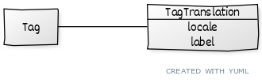

# Internationalisation de l'api

Pour moi l'api n'a pas besoin d'indiquer quel supporte plusieurs langue. Elle devrait répondre du contenu différent en fonction du header `Accept-Language`

Source : https://medium.com/@guillaume.viguierjust/building-a-multilingual-restful-api-2678add7febe

```
GET /resource
Accept-Language: fr-FR
{
  title: “Mon titre en Français”
}
GET /resource
Accept-Language: en-US
{
  title: “My title in English”
}
```

Le problème de cette approche, c'est que l'on ne peut pas savoir si un objet n'est pas disponible dans cette langue.

https://developer.mozilla.org/fr/docs/Web/HTTP/Headers/Accept-Language

Il existe aussi le header `Content-Language` a renvoyé en réponse en indiquant la langue que l'on utilise

Au niveau d'une communauté, on doit pouvoir indiquer les locales que l'on supporte

## Stockage en BDD des traductions

Je serais partant pour stocker les informations de la manière suivante:


