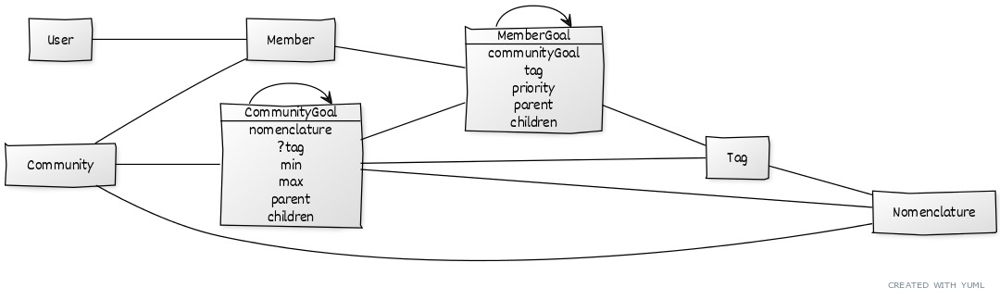

# Saisie de ses objectifs par un membre

## Brief

Au moment où un utilisateur rejoint une communauté, il doit indiquer pour quel raison il souhaite la rejoindre en définissant ses objectifs.

Pour chacun de ses objectifs il peut l'affiner et le prioriser par rapport a ses autres objectifs.



## Endpoint API

### Liste des objectifs / sous-objectifs possible

`GET /communities/{id}/goals` 

```
[
    {
        "id": 1,
        "nomenclature": {},
        "min": 1,
        "max": 4,
        "parent": {}, # or null
        "children": [],
        "tag": {}, # or null
        "position": 0
    }
]
```

- Nomenclature : l’ensemble des valeurs possibles
- Min / Max : nombre de valeur que l’on doit sélectionner pour remplir cette objectif
- Parent / Children : pour lier les objectifs entre eux
- Tag : si renseigné, permet de s’avoir que l’on doit prendre ce sous-objectif si on a choisi ce tag dans l’objectif parent
- Position : dans l’éventualité où l’on aurais plusieurs objectifs principaux a renseigner a l’inscription


### Liste des objectifs / sous-objectifs défini par le membre

`GET /members/{id}/goals`

```
[
    {
        goal: int
        tags: [{tag: {}, priority: int|null}],
    }
]
```


### Définir les objectifs d'un member

`POST /members/{id}/goals`

```
{
    goal: int
    tags: [{tag: int, priority: int|null}]
}
```

## Interrogation

- Comment va t’on pouvoir faire le mapping entre 2 objectifs ? (Par exemple ceux qui souhaitent vendre un objet A et ceux qui souhaitent l’acheter) -> **a mon avis on pourrait y penser plus tard en rajoutant des relations entre les différents objectifs**
- Mais est-ce que j’ai besoin d’un autre endpoint pour définir l’affinage de ses objectifs ? -> **on peut le faire en 2 étapes, en premier on renseigner juste les tags sans mettre de priorité, et ensuite on fait le même appel avec les priorités**
- Pour la liste des objectifs, 2 solution,
    - Soit on remonte tout + on a un filtre pour récupéré que les éléments qui nous intéresse (par exemple le parent),
        - Dans ce cas le champ children n’est pas utile et on a uniquement un identifiant dans le champ parent
    - Soit on récupère un arbre de valeur
