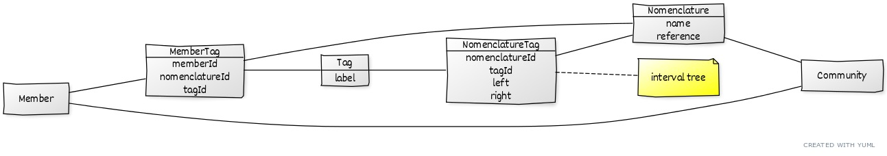

# Modélisation de la nomenclature

Nous devons pouvoir créer des nomenclatures pour une communauté afin de catégoriser ses membres.

Au niveau d'un membre nous pouvons le catégoriser dans une nomenclature en utilisant un tag ou plusieurs tags.

Une nomenclature correspond à un arbre de tags, par exemple les `Activities Fields` du domaine spaciales.

```
Ground
    Optics
    Optoelectonics
    Space Debris
    ...
Launcher
Life in Space
Space Apps
```

## Modèle de données


Source : http://yuml.me/preview/8b4d57cd

### Nomenclature

Pour chaque communauté, nous pouvons avoir plusieurs nomenclatures, par exemple `Activities Fields` ou `User Type`

### MemberTag

Permet de faire de lien entre les membres et les tags, On garde un lien vers la nomenclature du tag, car un même tags pourrais se retrouver dans plusieurs nomenclatures.

### NomenclatureTag

Permet de configurer l'arborescence des tags d'une nomenclature.

Techniquement nous allons stocker l'arborescence des tags sous forme d'un arbre ou d'[arbre d'intervalles](https://fr.wikipedia.org/wiki/Arbre_d%27intervalles) si besoin.
