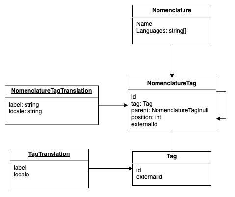

# Mapping Vimeet - Vimeet365

Une nomenclature est composée d'un ensemble de valeurs, celles-ci peuvent être hiérarchisées et ordonnées comme on le souhaite.
Toutes les valeurs peuvent être traduites dans plusieurs langues, ces valeurs peuvent être réutilisées dans plusieurs nomenclatures, pour chacune de ses nomenclatures, on doit pouvoir redéfinir les libellés.

Pour chacune de ses valeurs, on doit être capable de remonter a sa correspondance coté Vimeet, pour ça nous devons stocker des identifiants unique de type uuid.

Afin d'être compatible avec le modèle de vimeet, cette informations doit être portée par la table `nomenclature_tag`, mais pour notre modèle nous devons l'avoir au niveau de la table `tag`.

## Schéma décrivant le stockage des données



## Information sur la version utilisée par Vimeet

Les identifiants des différentes valeurs sont calculés a partir de la fonction php `uniqid` préfixé par un `u`.
Les valeurs possibles d'une nomenclature sont stockées dans un champ json au niveau de chaque nomenclature

## Import / Export de nomenclature

En 1ère étape on va uniquement proposer le remplissage de nomenclatures depuis un import / export.

Il faudrait faire l'import en 2 étapes, on charge en mémoire la nouvelle nomenclature pour faire une verification manuelle, on l'affiche et si elle correspond, on valide pour l'importer réèlement

On doit être capable d'importer un fichier provenant de Vimeet

### Proposition de format 

Nous partirions sur un format CSV, plus simple à traiter que le format de Vimeet.

```csv
id;parentId;fr;en
1234;;Ma valeur;My value
5678;1234;Ma sous-valeur;My sub value
```

Les libellés de la première ligne sont important à partir de la 3ème colonne, car celui-ci doit contenir le code de la langue (au format `ISO 639-1` et potentiellement suivi d'un code `ISO 3166-1 alpha-2`, par exemple `fr` ou `fr_FR`).

Je pense que l'on peut quand même supporter le format existant

### Déroulement de l'import

On se situe sur le formulaire d'édition d'une nomenclature, on dépose notre fichier csv dans un champ "fichier". 

#### Validation

- le fichier contient bien les colonnes necessaires (id + parent + 1 colonne par langue de la communauté)
- les identifiants de la 1ère colonne (id) doivent être unique ou vide
- les identifiants de la 2ème colonne (parent) doivent être présent dans la 1ère colonne ou vide
- dans le champ parent on peut avoir un `alias` (une valeur spéciale commençant par une arobase, par exemple : `@10`) celà veux dire que le parent de cette ligne se situe à la 10ème ligne du fichier.
- les id/parent ne doivent pas faire de boucle (par exemple le parent de 1 est 2 et le parent de 2 est 1 ne doit pas être possible)

#### Aperçu des modifications

On doit présenter sous forme d'arbre l'ensemble des valeurs présentes dans le fichier CSV, avec pour chacune les informations suivantes:
- Nouvelle valeur
- Valeur existante
- Libellé modifié (avec libellé précédent et libellé par défaut affiché)

#### Sauvegarde

Pour chaque valeur: 
- si l'identifiant fourni ne correspond pas à un `tag` ou à un `nomenclature_tag` existant nous devons créer un `tag` et un `nomenclature_tag` en indiquant cette identifiant externe dans les 2 tables.
- si cette valeur n'a pas d'identifiant unique dans le fichier, nous devons en générer un en utilisant la même technique que vimeet (via la fonction `uniquid`).
- si l'identifiant parent est un `alias`, on doit trouver la bonne valeur dans le fichier

### Déroulement de l'export

Depuis le formulaire d'édition d'une nomenclature, on clique sur le bouton "Exporter".

On récupère un fichier CSV, chaque ligne contenant les informations suivantes:
- l'identifiant unique du tag (qui se trouve au niveau de la table `tag`)
- l'identifiant unique du tag parent s'il y en as un.
- une colonne par langue défini au niveau de la nomenclature (ou de la communauté)

## Problème

En regardant la manière dont sont stocké les nomenclatures sur Vimeet, je n'ai aucun moyen de savoir si 2 elements avec le même identifiant correspondent a la même chose

## Limitation

Le mapping sera unidirectionnel dans un premier temps (Vimeet vers Vimeet365), pour le rendre bi-directionnel, il faudrait que l'on puisse exporter une nomenclature dans le format utilisé coté Vimeet.
